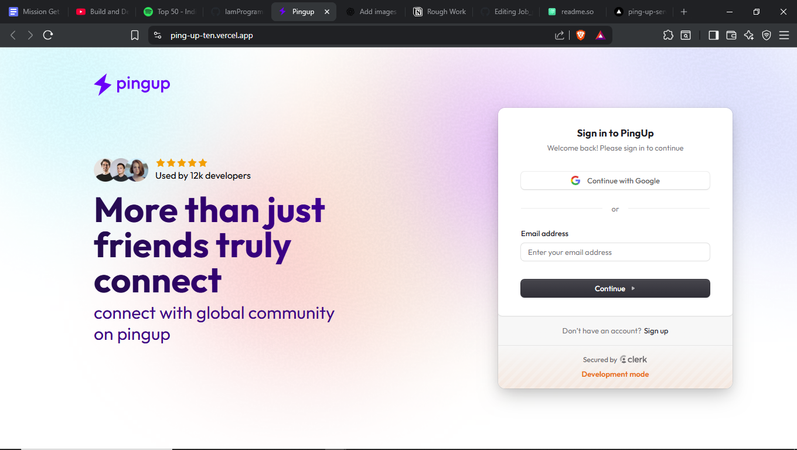
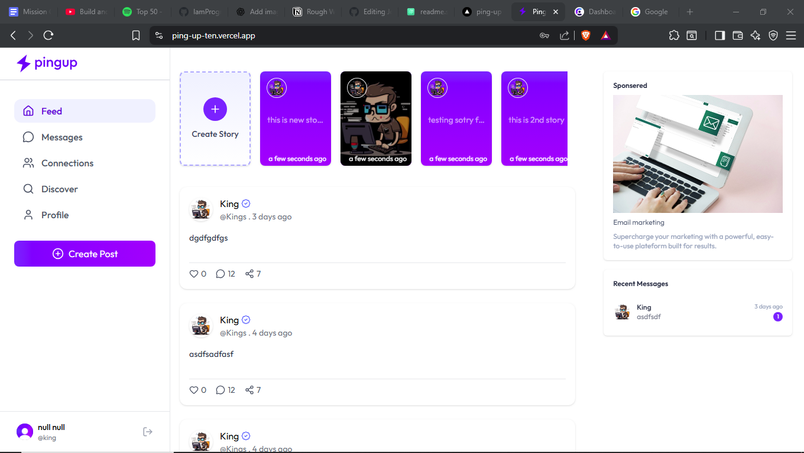

# PingUp – Social Media App

<p align="center">
  
  
</p>

## 📝 Project Description

**PingUp** is a modern social media platform built to connect users through posts, likes, comments, and real-time interactions. Designed with a sleek interface and responsive design, PingUp allows users to share their thoughts, follow others, and stay updated in a secure and engaging environment.

---

## 🚀 Live Demo

Check out the live version of PingUp here:

🔗 [View Live Site](https://your-pingup-live-link.com)

---

## 🚀 Features

### 👤 User Features

- User registration and login with JWT authentication
- Profile creation and editing (bio, profile picture, etc.)
- Create, edit, and delete posts (text, images)
- Like and comment on posts
- Follow and unfollow users
- Personalized user feed based on followed accounts
- Real-time notifications and updates

### 💬 Social Interactions

- Real-time chat/messaging between users
- Notifications for likes, comments, follows
- Explore section to discover new users and trending content

---

## 🛠️ Tech Stack

| Layer          | Technology                                |
| -------------- | ----------------------------------------- |
| Frontend       | React.js, HTML, CSS, JavaScript           |
| Backend        | Node.js, Express.js                       |
| Database       | MongoDB                                   |
| Authentication | Clerk                                     |
| Realtime       | Event Source (for chat and notifications) |
| Tools          | Clerk, Inngest Webhook, ImageKit, Brevo   |
| Deployment     | Vercel                                    |

---

## 🛠️ How to Clone and Run Locally

Follow these steps to clone and run PingUp locally on your machine:

### Step 1: Clone the repository

```bash
git clone https://github.com/IamProgrammer24/PingUp.git
```

### Step 2: Navigate into the project folder

```bash
cd PingUp
```

### Step 3: Install client dependencies

```bash
cd client
```

```bash
npm install
```

### Step 4: Install server dependencies

```bash
cd server
```

```bash
npm install
```

### Step 5: Run the application

```bash
npm run dev
```

```bash
npm run server
```

## Now open your browser and go to:

http://localhost:5173

---

## 🔐 Environment Variable Setup

Before running the application locally, make sure to configure environment variables by creating `.env` files in both the **backend** and **frontend** directories.

---

### 📁 Server (`/server/.env`)

```env
CLERK_PUBLISHABLE_KEY=your_clerk_publishable_key
```

```bash
CLERK_SECRET_KEY=your_clerk_secret_key
```

```bash
IMAGE_PUBLIC_KEY=your_imagekit_public_key
```

```bash
IMAGE_PRIVATE_KEY=your_imagekit_private_key
```

```bash
IMAGE_URL_ENDPOINT=your_imagekit_url
```

```bash
SENDER_EMAIL=mail@gmail.com
```

```bash
SMTP_USER=your_brevo_user_id
```

```bash
SMTP_PASS=your_brevo_user_pass
```

```bash
MONGODB_URI=mongodb://localhost:27017/pingup_db
```

```bash
INNGEST_EVENT_KEY=your_inngest_event_key
```

```bash
INNGEST_SIGNING_KEY=your_inngest_signing_key
```

```bash
FRONTEND_URL=http://localhost:5173
```

### 📁 client (`/client/.env`)

```bash
VITE_CLERK_PUBLISHABLE_KEY=your_clerk_publishable_key
```

```bash
VITE_BASEURL=http://localhost:4000
```

---

## Contributing

Contributions are welcome! If you'd like to help improve this project, feel free to:

- 🔧 Fix bugs.
- 💡 Suggest or add new features
- 🧪 Improve design or responsiveness
- 📝 Enhance documentation

---

## 👨‍💻 Author

**Brajesh Chhekur**

📧 Email: 281092322419e@gmail.com  
If you like this project, feel free to ⭐ star it, fork it, or open an issue!
